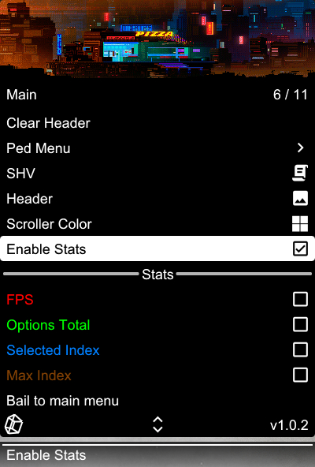

# Special K

---
## Projects
| Project | Description | Link |
|---------|-------------|------|
| **SINGULARITY** | Custom RDR2 mod menu — ImGui interface, smooth animations, panel systems, keybind management, binary config | [Private] |
| **SirMestreRDR2Base** | Updated fork of SirMestre's RDR2 base | [Repo](https://github.com/specialktm/SirMestreRDR2Base) |
---
## SINGULARITY — Features

  

 
- Full ImGui-based mod menu for **Red Dead Redemption 2**
- Smooth submenu transitions and scroller animations
- Panel system with drag-attach docking and notification effects
- Global keybind registry with F4-to-bind workflow
- Binary config system with profile support
- CRTP option architecture — toggle, slider, color, input, keybind types
- Display-scaled notification manager with progress bars and history
- Lua scripting API
---
## SirMestreRDR2Base
Updated fork of [SirMestre's RDR2 Base](https://github.com/SirMestre/SirMestreRDR2Base) — grab it [here](https://github.com/specialktm/SirMestreRDR2Base).